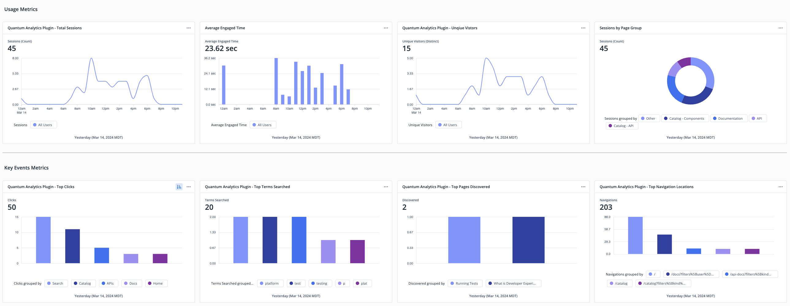

# Analytics Module: Quantum Metric


Welcome to the Quantum Metric Analytics Plugin for Backstage! This plugin aims to provide a quick and robust means to
integrate Quantum Metric analytics with your Backstage instance.



## Installation

### Install the plugin

```bash
yarn --cwd packages/app add @qm/plugin-analytics-module-qm
```

### Open the `packages/app/src/apis.ts` file and import the required dependencies

```JS
import {
  analyticsApiRef,
  configApiRef,
  identityApiRef,
} from '@backstage/core-plugin-api';
import { QuantumMetric } from '@qm/plugin-analytics-module-qm';

```

### Next, add the following code to `packages/app/src/apis.ts` to create the Quantum Metric Analytics API

```JS
  createApiFactory({
    api: analyticsApiRef,
    deps: { configApi: configApiRef, identityApi: identityApiRef },
    factory: ({ configApi, identityApi }) =>
      QuantumMetric.fromConfig(configApi, {
        identityApi,
      }),
  }),
```

## Configuration

After installing the plugin, the Quantum Metric Analytics plugin will need to be configured. The options and reference
example are detailed below.

### Configuration Options

The table below lists the available configuration options for the Quantum Metric Analytics plugin:

| Field Name        | Type                                  | Required | Default | Description                                                                                                      |
| ----------------- | ------------------------------------- | -------- | ------- | ---------------------------------------------------------------------------------------------------------------- |
| enabled           | boolean                               | Yes      |         | Disables plugin.                                                                                                 |
| src               | string                                | Yes      |         | CDN location of Quantum Metric API. The value is `qtm.src` on your subscriptions Install page.                   |
| debug             | boolean                               | No       | `false` | Turns on console.debug messages.                                                                                 |
| test              | boolean                               | No       | `false` | When enabled, events are logged to console instead of sent to Quantum Metric.                                    |
| async             | boolean                               | No       | `false` | Sets the async attribute of the resulting HTML `<script>` element.                                               |
| events.mappings   | list of {name: string, id: integer}   | Yes      | `{}`    | Maps Backstage `AnalyticsEvent` actions to Quantum Metric Event ID's as a list of objects with `name` and `id`.  |
| events.attributes | list of {name: string, value: string} | Yes      | `{}`    | Included on every event sent to Quantum Metric under Event Details as a list of objects with `name` and `value`. |

### Example Configuration

Below is a reference configuration file:

```YAML
app:
analytics:
  qm:
    enabled: true
    src: https://cdn.quantummetric.com/qscripts/quantum-$SUB_NAME.js
    debug: false
    test: false
    async: false
    events:
      mappings:
        - name: navigate
          id: $QUANTUM_NAVIGATE_EVENT_ID
        - name: click
          id: $QUANTUM_CLICK_EVENT_ID
        - name: search
          id: $QUANTUM_SEARCH_EVENT_ID
        - name: discover
          id: $QUANTUM_DISCOVER_EVENT_ID
      attributes:
        - name: environment
          value: development
        - name: version
          value: 0.0.1
```

Where the event mappings IDs are the Quantum Metric event IDs you wish to send.

### Event Transformers

The plugin comes with default Event Transformers for each predefined [Backstage key
event](https://backstage.io/docs/plugins/analytics/#key-events) as described in
[Default Transformers](#default-transformers). However, you can customize or extend these transformers. To override a
default transformer or add transformers for new actions, modify the Analytics API configuration as follows:

```JS
  createApiFactory({
    api: analyticsApiRef,
    deps: { configApi: configApiRef },
    factory: ({ configApi }) =>
      QuantumMetric.fromConfig(configApi, {
        eventTransforms: {
          discover: (event, mapping) => {
            return { eventId: mapping[event.action], eventValue: event.attributes.to, attributes: { ...event.attributes, event.subject } };
          },
        },
      }),
  })
```

In the above example, the default transformer for the discover key event is overridden. The value sent to Quantum Metric
is changed to `event.attributes.to` instead of the provided `event.subject`, and the `event.subject` is added as an
attribute.

#### Default Transformers

There is a transformer for every [Backstage key
event](https://backstage.io/docs/plugins/analytics/#key-events), and a default transformer when an action is not found
in the `eventTransforms` record. The definitions can be found in [src/api/util/transforms.ts](./src/api/util/transforms.ts).

| Backstage Analytics Action | Quantum Metric Event ID                    | Quantum Metric Event Value                                   | Quantum Metric Event Attributes                                                            | Quantum Metric Event Conversion |
| -------------------------- | ------------------------------------------ | ------------------------------------------------------------ | ------------------------------------------------------------------------------------------ | ------------------------------- |
| `sendEvent`                | Set to Backstage event subject             | Set to Backstage event value                                 | Event attributes                                                                           | Set to `false`                  |
| `navigate`                 | Mapped from configuration `event.mappings` | Set to Backstage event subject                               | Combined attributes from context and event attributes                                      | Set to `false`                  |
| `search`                   | Mapped from configuration `event.mappings` | Set to Backstage event subject                               | Combined attributes from context, event attributes, and `results-found` from event value   | Set to `false`                  |
| `discover`                 | Mapped from configuration `event.mappings` | Set to Backstage event subject                               | Combined attributes from context, event attributes, and `search-position` from event value | Set to `false`                  |
| `click`                    | Mapped from configuration `event.mappings` | Set to Backstage event subject                               | Combined attributes from context and event attributes                                      | Set to `false`                  |
| `defaultEventTransform`    | Mapped from configuration `event.mappings` | Set to Backstage event value and if not present then subject | Combined attributes from context and event  attributes                                     | Set to `false`                  |

### Identity

To configure identity from Backstage to Quantum Metric provide the `IdentityAPI` to the plugin like so:

```JS
  createApiFactory({
    api: analyticsApiRef,
    deps: { configApi: configApiRef },
    factory: ({ configApi, identityApi }) =>
      QuantumMetric.fromConfig(configApi, {
        identityApi
      }),
  }),
```

This will identify users in Quantum Metric by their Backstage profile email.

### Global Attributes

Global attributes allow you to add attributes to all events sent through the Quantum Metric analytics plugin. When
configured, these attributes will be included in the event details in Quantum Metric.

To configure global attributes, use the following format in your configuration file:

```YAML
app:
  analytics:
    qm:
      events:
        attributes:
          - name: environment
            value: development
          - name: version
            value: 0.0.1
```

With the above configuration, the event details in Quantum Metric will include the following attributes:

```JSON
{
  "environment": "development",
  "version": "0.0.1"
}
```

If the event is generated from Backstage events and includes attributes via the event transformers, those attributes
will also be included along with the global attributes.

For example, if a search event is triggered with the default event transformer it includes the attribute `results-found`
and also has the global attributes configured, the event details will look like this:

```JSON
{
  "results-found": 10,
  "environment": "development",
  "version": "0.0.1"
}
```

Note: In the case of attribute name collisions between global attributes and event-specific attributes, the global
attributes will take precedence and be included in the event details.

### Capturing Events

With the Quantum Metric plugin fully installed and configured, Backstage key events will be captured without extra
effort.

#### Instrumenting events

To send events that are defined in the configuration's event mappings or event transformers, you can use the
useAnalytics hook provided by `@backstage/core-plugin-api`.

Here's an example of capturing a basic event:

```JS
import { useAnalytics } from '@backstage/core-plugin-api';

const analytics = useAnalytics();

analytics.captureEvent('catalog-updated', catalogEntityName);
```

If you want to add more information sent to Quantum Metric, you can include additional attributes:

```JS
analytics.captureEvent('catalog-updated', catalogEntityName {
  value: numOfEntitiesUpdated,
  attributes: {
    entityOwner,
    entityType,
    userTeam,
  },
});
```

These additional attributes will show up under the events details in Quantum Metric.

The specific configuration for the `catalog-updated` event can be defined either in the event mappings or with an event
transformer.

Example event mappings configuration:

```YAML
app:
analytics:
  qm:
    events:
      mappings:
        - name: catalog-updated
          id: $QUANTUM_METRIC_CATALOG_UPDATED_EVENT_ID
```

Alternatively, the default event transformer can be extended to capture more attributes for `catalog-updated`:

```JS
  createApiFactory({
    api: analyticsApiRef,
    deps: { configApi: configApiRef },
    factory: ({ configApi }) =>
      QuantumMetric.fromConfig(configApi, {
        eventTransforms: {
          'catalog-updated': (event, mapping) => {
            return {
                eventId: mapping[event.action],
                eventValue: event.subject,
                attributes: { ...event.attributes, ...event.context, numberOfAffectedEntities: event.value }
            };
          },
        },
      }),
  })
```

#### Context

Additional information can also be added to Quantum Metric event details with the context React component.

```JSX
import { AnalyticsContext, useAnalytics } from '@backstage/core-plugin-api';

const GreetingComponent = ({ name }) => {
  const analytics = useAnalytics();
  const handleClick = () => analytics.captureEvent('greeted', name);
  return <button onClick={handleClick}>Say Hello to {name}</button>;
};

const GreetingComponentWrapper = () => {
  return (
    <AnalyticsContext attributes={{ admin: true }}>
      <GreetingComponent name={'Alice'} />
    </AnalyticsContext>
  );
};
```

When the `GreetingComponent` button is clicked, it will send a `greeted` event to Quantum Metric with the value of
`Alice`, and the event details will include information about `Alice` being an admin.

## Contributing

Before submitting your pull request, ensure your title follows the semantic commit format. This not only helps our
maintainers but also improves the overall transparency and readability of our project history.

For more detailed contributions guidelines, check our [CONTRIBUTING.md](./CONTRIBUTING.md) file.

### Local Development

#### Install dependencies

```bash
yarn install
```

#### Build dist folder

```bash
yarn build
```

#### From your Backstage directory run the following where `$INSTALL_PATH` is the path of this repo

```bash
yarn add @qm/plugin-analytics-module-qm@link:$INSTALL_PATH
```

Note: If making changes to `config.d.ts` against a Backstage instance started with `backstage-cli package start`,
changes will not take effect till the next `backstage-cli package start`

### Semantic Commit Messages

In this project, we enforce the use of semantic commit messages to streamline our release and changelog generation
process. This ensures our commit history is readable and understandable.

#### What are Semantic Commit Messages?

Semantic commit messages follow a structured format to clearly describe the purpose and intent of each commit. The
general format is:

- `<type>`: This denotes the kind of change you're making. Common types include `feat` (new features), `fix` (bug
  fixes), `docs` (documentation changes), `style` (code styling, no functional changes), `refactor` (code changes that
  neither fix bugs nor add features), `perf` (performance improvements), `test` (adding missing tests), and `chore`
  (maintenance tasks).

- `<scope>`: A scope provides additional contextual information, such as the part of the codebase affected (optional).

- `<description>`: A brief, imperative mood description of the change.

Examples:

- `feat(auth): implement JWT authentication`
- `fix(server): resolve memory leak issue`
- `chore(readme): update installation instructions`

### Enforcing Semantic Commits

This project uses the [`amannn/action-semantic-pull-request`](https://github.com/amannn/action-semantic-pull-request)
GitHub Action to ensure all pull requests follow the semantic commit format. The action checks your pull request titles,
not the individual commit messages. Make sure your PR titles follow the semantic format.

If your pull request title does not meet the semantic requirements, the check will fail, and you'll need to update the
title accordingly. You can also add multiple types if your pull request covers more than one scope, separated by commas
(e.g., `feat, fix: implement new feature and fix a bug`).

### Semantic Versioning

This project uses the [`release-it`](https://github.com/release-it/release-it) nodeJS utility to increment software
version numbers, automatically create GitHub tags and Releases and auto-publish to `npm`.

Semantic versioning works by interpreting your semantic commit as described in the previous section and assigning it a
classification based on the level of severity of the work. That classification then translates into a version number
that follows the sequence: `Major.Minor.Patch`.

When a major, minor, or patch update is made, the corresponding number is increased.

- Major version changes when incompatible API changes are made.
- Minor version changes when new functionality is added backward-compatible manner.
- Patch version changes when backward-compatible bug fixes are made.

The table below describes the relationship between the semantic commit message and the semantic version sequence:

| Commit Message                                    | Inferred Type | Example Sequence Update |
| ------------------------------------------------- | ------------- | ----------------------- |
| `feat(auth): implement JWT authentication`        | Major         | 1.0.0                   |
| `fix(server): resolve memory leak issue`          | Minor         | 0.1.0                   |
| `chore(readme): update installation instructions` | Patch         | 0.0.1                   |
